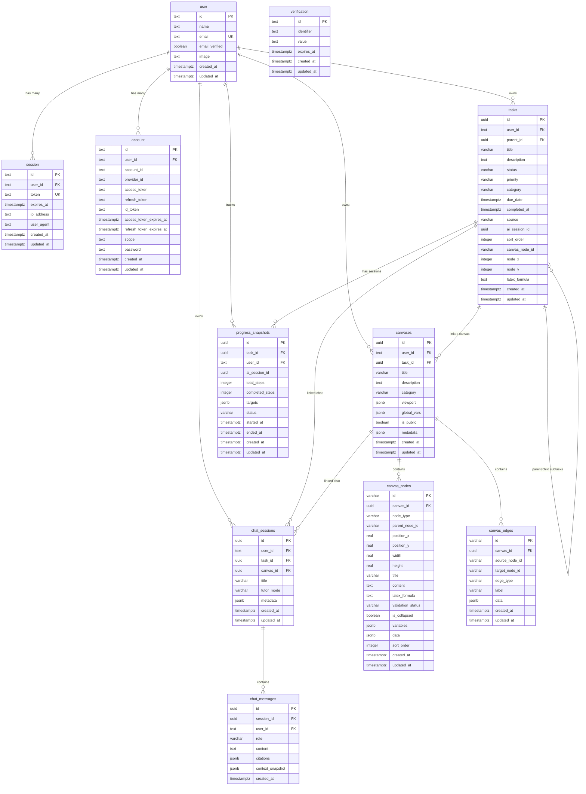

# DATABASE.md — Nexora Database Architecture & Schema Reference

## Overview
Nexora utilizes PostgreSQL (via Supabase / Neon) managed through Drizzle ORM. The database stores user authentication states, hierarchical academic task items, AI brainstorming progress snapshots, interactive STEM Canvas logic tree graphs, and context-aware chat conversation sessions.

---

## 1. Entity Relationship Overview

---

## 2. Table Schemas & Constraints

### 2.1 `user` (Better Auth)
| Column | Type | Constraints | Description |
|---|---|---|---|
| `id` | `TEXT` | `PRIMARY KEY` | User unique identifier (CUID/UUID string) |
| `name` | `TEXT` | `NOT NULL` | Display name from Google Profile |
| `email` | `TEXT` | `NOT NULL, UNIQUE` | User email address |
| `email_verified` | `BOOLEAN` | `NOT NULL, DEFAULT FALSE` | Email verification flag |
| `image` | `TEXT` | `NULL` | Google avatar profile URL |
| `created_at` | `TIMESTAMPTZ`| `NOT NULL, DEFAULT now()` | Registration timestamp |
| `updated_at` | `TIMESTAMPTZ`| `NOT NULL, DEFAULT now()` | Last update timestamp |

**Indexes:**
- `idx_user_email` on (`email`)

---

### 2.2 `session` (Better Auth)
| Column | Type | Constraints | Description |
|---|---|---|---|
| `id` | `TEXT` | `PRIMARY KEY` | Session ID |
| `user_id` | `TEXT` | `NOT NULL, REFERENCES user(id) ON DELETE CASCADE` | Associated user |
| `token` | `TEXT` | `NOT NULL, UNIQUE` | Active session token |
| `expires_at` | `TIMESTAMPTZ`| `NOT NULL` | Session expiry |
| `ip_address` | `TEXT` | `NULL` | Client IP address |
| `user_agent` | `TEXT` | `NULL` | Client User-Agent string |
| `created_at` | `TIMESTAMPTZ`| `NOT NULL, DEFAULT now()` | Session creation |
| `updated_at` | `TIMESTAMPTZ`| `NOT NULL, DEFAULT now()` | Last update timestamp |

**Indexes:**
- `idx_session_user_id` on (`user_id`)
- `idx_session_token` on (`token`)

---

### 2.3 `account` (Better Auth OAuth Connections)
| Column | Type | Constraints | Description |
|---|---|---|---|
| `id` | `TEXT` | `PRIMARY KEY` | Account link identifier |
| `user_id` | `TEXT` | `NOT NULL, REFERENCES user(id) ON DELETE CASCADE` | Owner user |
| `account_id` | `TEXT` | `NOT NULL` | Provider subject/account ID |
| `provider_id` | `TEXT` | `NOT NULL` | Provider name (`google`) |
| `access_token`| `TEXT` | `NULL` | OAuth access token |
| `refresh_token`| `TEXT`| `NULL` | OAuth refresh token |
| `id_token` | `TEXT` | `NULL` | OpenID Connect ID token |
| `scope` | `TEXT` | `NULL` | Granted OAuth scopes |
| `created_at` | `TIMESTAMPTZ`| `NOT NULL, DEFAULT now()` | Link creation |
| `updated_at` | `TIMESTAMPTZ`| `NOT NULL, DEFAULT now()` | Link update |

**Indexes:**
- `idx_account_user_id` on (`user_id`)
- `idx_account_provider` on (`provider_id`, `account_id`)

---

### 2.4 `tasks` (Tasks & AI Study Planner Items)
| Column | Type | Constraints | Description |
|---|---|---|---|
| `id` | `UUID` | `PRIMARY KEY, DEFAULT gen_random_uuid()` | Task unique identifier |
| `user_id` | `TEXT` | `NOT NULL, REFERENCES user(id) ON DELETE CASCADE` | Task owner |
| `parent_id` | `UUID` | `NULL, REFERENCES tasks(id) ON DELETE CASCADE` | Self-referential subtask parent |
| `title` | `VARCHAR(255)`| `NOT NULL` | Task title |
| `description`| `TEXT` | `NULL` | Task description / notes |
| `status` | `VARCHAR(20)` | `NOT NULL, DEFAULT 'todo'` | `'todo' \| 'in_progress' \| 'completed' \| 'cancelled'` |
| `priority` | `VARCHAR(10)` | `NOT NULL, DEFAULT 'medium'` | `'low' \| 'medium' \| 'high' \| 'urgent'` |
| `category` | `VARCHAR(50)` | `NULL` | Subject / Domain |
| `due_date` | `TIMESTAMPTZ`| `NULL` | Target completion deadline |
| `completed_at`| `TIMESTAMPTZ`| `NULL` | Timestamp when completed |
| `source` | `VARCHAR(20)` | `NOT NULL, DEFAULT 'manual'` | `'manual' \| 'ai_planner' \| 'ai_brainstorm'` |
| `ai_session_id`| `UUID` | `NULL` | AI correlation ID |
| `sort_order` | `INTEGER` | `NOT NULL, DEFAULT 0` | Display sorting priority |
| `canvas_node_id`| `VARCHAR(100)`| `NULL` | Associated canvas node ID |
| `node_x` | `INTEGER` | `NULL` | Suggested X position |
| `node_y` | `INTEGER` | `NULL` | Suggested Y position |
| `latex_formula`| `TEXT` | `NULL` | LaTeX formula |
| `created_at` | `TIMESTAMPTZ`| `NOT NULL, DEFAULT now()` | Created timestamp |
| `updated_at` | `TIMESTAMPTZ`| `NOT NULL, DEFAULT now()` | Updated timestamp |

**Indexes:**
- `idx_tasks_user_id` on (`user_id`)
- `idx_tasks_parent_id` on (`parent_id`)
- `idx_tasks_status` on (`user_id`, `status`)
- `idx_tasks_due_date` on (`user_id`, `due_date`)
- `idx_tasks_canvas_node` on (`canvas_node_id`)

---

### 2.5 `canvases` (STEM Logic Tree Canvases)
| Column | Type | Constraints | Description |
|---|---|---|---|
| `id` | `UUID` | `PRIMARY KEY, DEFAULT gen_random_uuid()` | Canvas unique identifier |
| `user_id` | `TEXT` | `NOT NULL, REFERENCES user(id) ON DELETE CASCADE` | Canvas owner |
| `task_id` | `UUID` | `NULL, REFERENCES tasks(id) ON DELETE SET NULL` | Optional associated task |
| `title` | `VARCHAR(255)`| `NOT NULL` | Canvas title |
| `description`| `TEXT` | `NULL` | Canvas problem description |
| `category` | `VARCHAR(50)` | `NULL` | STEM discipline / domain |
| `viewport` | `JSONB` | `NOT NULL, DEFAULT '{"x":0,"y":0,"zoom":1}'` | React Flow viewport state |
| `global_vars`| `JSONB` | `NOT NULL, DEFAULT '[]'` | Global simulation variable sliders |
| `is_public` | `BOOLEAN` | `NOT NULL, DEFAULT FALSE` | Public sharing flag |
| `metadata` | `JSONB` | `NOT NULL, DEFAULT '{}'` | Extension metadata |
| `created_at` | `TIMESTAMPTZ`| `NOT NULL, DEFAULT now()` | Creation timestamp |
| `updated_at` | `TIMESTAMPTZ`| `NOT NULL, DEFAULT now()` | Last update timestamp |

**Indexes:**
- `idx_canvases_user_id` on (`user_id`)
- `idx_canvases_task_id` on (`task_id`)
- `idx_canvases_category` on (`user_id`, `category`)

---

### 2.6 `canvas_nodes` (DAG Logic & Formula Nodes)
| Column | Type | Constraints | Description |
|---|---|---|---|
| `id` | `VARCHAR(100)`| `PRIMARY KEY` | React Flow Node ID (e.g. `node-1`) |
| `canvas_id` | `UUID` | `NOT NULL, REFERENCES canvases(id) ON DELETE CASCADE` | Parent canvas |
| `node_type` | `VARCHAR(30)` | `NOT NULL` | `'problem_root' \| 'reasoning_step' \| 'what_if_branch' \| 'theorem_proof' \| 'formula_block'` |
| `parent_node_id`| `VARCHAR(100)`| `NULL` | Hierarchical group / step parent |
| `position_x` | `REAL` | `NOT NULL, DEFAULT 0` | X position on canvas |
| `position_y` | `REAL` | `NOT NULL, DEFAULT 0` | Y position on canvas |
| `width` | `REAL` | `NULL` | Custom width |
| `height` | `REAL` | `NULL` | Custom height |
| `title` | `VARCHAR(255)`| `NOT NULL` | Node header / step title |
| `content` | `TEXT` | `NULL` | Text explanation / markdown notes |
| `latex_formula`| `TEXT` | `NULL` | KaTeX mathematical LaTeX formula |
| `validation_status`| `VARCHAR(20)`| `NOT NULL, DEFAULT 'tentative'` | `'valid' \| 'tentative' \| 'erroneous'` |
| `is_collapsed`| `BOOLEAN` | `NOT NULL, DEFAULT FALSE` | Branch collapsed state |
| `variables` | `JSONB` | `NOT NULL, DEFAULT '[]'` | Node parameter sliders |
| `data` | `JSONB` | `NOT NULL, DEFAULT '{}'` | Type-specific custom payload |
| `sort_order` | `INTEGER` | `NOT NULL, DEFAULT 0` | Execution / step order |
| `created_at` | `TIMESTAMPTZ`| `NOT NULL, DEFAULT now()` | Creation timestamp |
| `updated_at` | `TIMESTAMPTZ`| `NOT NULL, DEFAULT now()` | Last update timestamp |

**Indexes:**
- `idx_canvas_nodes_canvas_id` on (`canvas_id`)
- `idx_canvas_nodes_parent` on (`canvas_id`, `parent_node_id`)
- `idx_canvas_nodes_type` on (`canvas_id`, `node_type`)

---

### 2.7 `canvas_edges` (Logical DAG Connectors)
| Column | Type | Constraints | Description |
|---|---|---|---|
| `id` | `VARCHAR(100)`| `PRIMARY KEY` | Edge ID (e.g. `e1-2`) |
| `canvas_id` | `UUID` | `NOT NULL, REFERENCES canvases(id) ON DELETE CASCADE` | Parent canvas |
| `source_node_id`| `VARCHAR(100)`| `NOT NULL` | Origin node ID |
| `target_node_id`| `VARCHAR(100)`| `NOT NULL` | Destination node ID |
| `edge_type` | `VARCHAR(30)` | `NOT NULL, DEFAULT 'implication'` | `'implication' \| 'alternative' \| 'dependency' \| 'contradiction'` |
| `label` | `VARCHAR(100)`| `NULL` | Edge annotation |
| `data` | `JSONB` | `NOT NULL, DEFAULT '{}'` | Justification & confidence data |
| `created_at` | `TIMESTAMPTZ`| `NOT NULL, DEFAULT now()` | Creation timestamp |
| `updated_at` | `TIMESTAMPTZ`| `NOT NULL, DEFAULT now()` | Last update timestamp |

**Indexes:**
- `idx_canvas_edges_canvas_id` on (`canvas_id`)
- `idx_canvas_edges_source` on (`canvas_id`, `source_node_id`)
- `idx_canvas_edges_target` on (`canvas_id`, `target_node_id`)

---

### 2.8 `chat_sessions` (AI Chat Conversations)
| Column | Type | Constraints | Description |
|---|---|---|---|
| `id` | `UUID` | `PRIMARY KEY, DEFAULT gen_random_uuid()` | Conversation session identifier |
| `user_id` | `TEXT` | `NOT NULL, REFERENCES user(id) ON DELETE CASCADE` | Session owner |
| `task_id` | `UUID` | `NULL, REFERENCES tasks(id) ON DELETE SET NULL` | Optional associated task |
| `canvas_id` | `UUID` | `NULL, REFERENCES canvases(id) ON DELETE SET NULL`| Optional associated canvas |
| `title` | `VARCHAR(255)`| `NOT NULL, DEFAULT 'New Brainstorming Session'` | Conversation header |
| `tutor_mode`| `VARCHAR(30)` | `NOT NULL, DEFAULT 'socratic'` | `'socratic' \| 'olympiad' \| 'step_breakdown' \| 'thesis_mentor'` |
| `metadata` | `JSONB` | `NOT NULL, DEFAULT '{}'` | Custom parameters |
| `created_at`| `TIMESTAMPTZ`| `NOT NULL, DEFAULT now()` | Creation timestamp |
| `updated_at`| `TIMESTAMPTZ`| `NOT NULL, DEFAULT now()` | Last update timestamp |

**Indexes:**
- `idx_chat_sessions_user` on (`user_id`)
- `idx_chat_sessions_task` on (`task_id`)
- `idx_chat_sessions_canvas` on (`canvas_id`)
- `idx_chat_sessions_updated` on (`user_id`, `updated_at`)

---

### 2.9 `chat_messages` (Chat History & Citations)
| Column | Type | Constraints | Description |
|---|---|---|---|
| `id` | `UUID` | `PRIMARY KEY, DEFAULT gen_random_uuid()` | Message identifier |
| `session_id`| `UUID` | `NOT NULL, REFERENCES chat_sessions(id) ON DELETE CASCADE` | Parent session |
| `user_id` | `TEXT` | `NOT NULL, REFERENCES user(id) ON DELETE CASCADE` | Message author |
| `role` | `VARCHAR(20)` | `NOT NULL` | `'user' \| 'assistant' \| 'system'` |
| `content` | `TEXT` | `NOT NULL` | Message markdown with LaTeX math |
| `citations` | `JSONB` | `NOT NULL, DEFAULT '[]'` | Array of `ChatSourceCitation` references |
| `context_snapshot` | `JSONB` | `NULL` | Task/Canvas snapshot attached at message time |
| `created_at`| `TIMESTAMPTZ`| `NOT NULL, DEFAULT now()` | Timestamp |

**Indexes:**
- `idx_chat_messages_session` on (`session_id`, `created_at`)
- `idx_chat_messages_user` on (`user_id`)
